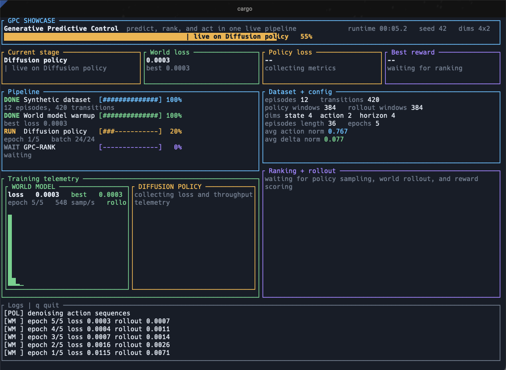
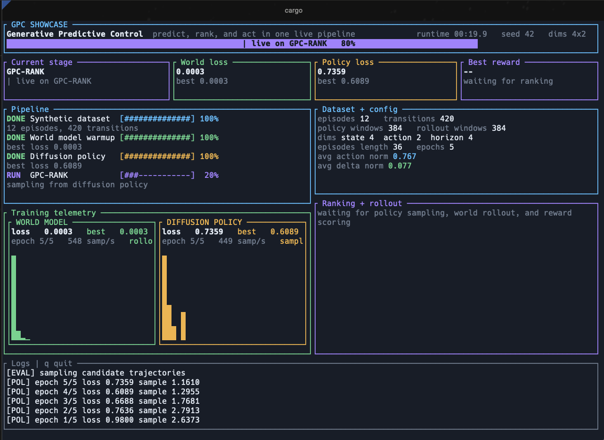

# gpc-rs

[](https://github.com/AbdelStark/gpc_rs/actions)
[](LICENSE)
[](rust-toolchain.toml)
[](https://arxiv.org/pdf/2502.00622)

Rust implementation of [*Generative Robot Policies via Predictive World Modeling*](https://arxiv.org/pdf/2502.00622). A diffusion policy proposes candidate action sequences, a learned world model imagines their consequences, and an evaluator scores and selects the best trajectory — all composed at inference time in a closed-loop replanning cycle.

Built on [Burn](https://burn.dev) for training and [Tract](https://github.com/sonos/tract) for ONNX inference.

## Demos

### Interactive Web Demo

A browser-based visualization of the full GPC pipeline running in real time against a 2-link robot arm navigating around obstacles.

The native Rust server trains both models from synthetic demonstrations in ~1 second, then serves a REST API that the React frontend consumes to visualize closed-loop replanning: candidate trajectories from the diffusion policy, world-model rollouts, GPC-RANK selection, GPC-OPT refinement, and the resulting executed path.

```bash
# Terminal 1 — start the planner server
cargo run --release -p gpc-demo-server

# Terminal 2 — start the frontend
cd web-demo && npm install && npm run dev

# Open http://localhost:5174
```

See [docs/demo-explained.md](docs/demo-explained.md) for a detailed walkthrough of every visual element and how it maps to the paper.

### Terminal TUI Demo

<p align="center">
  
  
</p>

```bash
cargo run -p world-models-gpc-cli -- demo          # interactive TUI
cargo run -p world-models-gpc-cli -- demo --plain   # plain terminal output
```

## Pipeline

The codebase follows the same high-level decomposition as the paper:

```
Training (offline):
  Expert demonstrations
      ├── Phase 1: single-step MSE ──→ World Model
      ├── Phase 2: rollout MSE ──────→ World Model (refined)
      └── DDPM noise prediction ─────→ Diffusion Policy

Inference (per step, closed-loop):
  Observation history
      │
      ├── policy.sample_k(K) ──→ K candidate action sequences
      │         │
      │         ▼
      │   world_model.rollout() ──→ K predicted trajectories
      │         │
      │         ▼
      │   reward.score() ──→ K scalar scores
      │         │
      │         ├── GPC-RANK: argmax ──→ best trajectory
      │         └── GPC-OPT:  gradient ascent ──→ refined trajectory
      │                   │
      └──── execute first action only, then replan
```

1. **Diffusion policy** generates diverse candidate action sequences via DDPM reverse diffusion.
2. **World model** rolls each candidate forward, predicting future states step by step.
3. **Reward function** scores each imagined trajectory (progress, goal proximity, obstacle clearance).
4. **GPC-RANK** selects the highest-scoring candidate. **GPC-OPT** gradient-refines a candidate via finite differences.
5. Only the first action of the winning trajectory executes. The system replans from the actual state every step.

## Scope

This is a clean systems-oriented Rust implementation of the GPC framework. It is useful for:

- Experimenting with the GPC decomposition (policy + world model + evaluator)
- Training on synthetic data and inspecting the full pipeline
- Running end-to-end demos through the CLI or the interactive web demo
- Exercising the crate APIs from Rust code
- Inspecting ONNX models and checkpoint metadata

The official Python implementation is at [han20192019/gpc_code](https://github.com/han20192019/gpc_code). Use that as the primary reference for paper-aligned training and benchmark reproduction.

## Workspace Layout

| Crate | Responsibility |
| --- | --- |
| `gpc-core` | Shared config types, error handling, core traits, tensor utilities, diffusion schedules |
| `gpc-policy` | Diffusion policy with DDPM-style denoising network |
| `gpc-world` | State dynamics model (residual MLP) and reward functions |
| `gpc-eval` | `GpcRank` and `GpcOpt` evaluators |
| `gpc-train` | Dataset handling, synthetic data generation, training orchestration |
| `gpc-compat` | Checkpoint metadata I/O and ONNX inspection/runtime |
| `gpc-cli` | Command-line entrypoint, training, evaluation, and TUI demo |
| `gpc-demo-server` | Native HTTP server for the web demo (axum, trains on startup) |
| `gpc-wasm` | WebAssembly build of the engine (experimental) |
| `web-demo` | React + TypeScript frontend for the interactive demo |

Shared dependencies: Burn `0.20.1`, stable Rust `1.85`, CI for `check`, `test`, `clippy -D warnings`, and `fmt --check`.

## Published Packages

The crates are published to crates.io with a `world-models-` prefix:

| Workspace crate | crates.io package |
| --- | --- |
| `gpc-core` | `world-models-gpc-core` |
| `gpc-policy` | `world-models-gpc-policy` |
| `gpc-world` | `world-models-gpc-world` |
| `gpc-eval` | `world-models-gpc-eval` |
| `gpc-train` | `world-models-gpc-train` |
| `gpc-compat` | `world-models-gpc-compat` |
| `gpc-cli` | `world-models-gpc-cli` |

## Quick Start

### Requirements

- Rust `1.85+` (pinned in [rust-toolchain.toml](rust-toolchain.toml))
- Node.js `18+` (for the web demo only)

### Build and Verify

```bash
cargo build --workspace
cargo test --workspace
cargo clippy --workspace --all-targets -- -D warnings
cargo fmt --all -- --check
```

### Run the Web Demo

```bash
# Build the server in release mode (first time only)
cargo build --release -p gpc-demo-server

# Start the planner server (trains models in ~1s, serves on :3100)
cargo run --release -p gpc-demo-server

# In another terminal
cd web-demo && npm install && npm run dev
# Open http://localhost:5174
```

### Run the TUI Demo

```bash
cargo run -p world-models-gpc-cli -- demo
```

Smaller smoke-test:

```bash
cargo run -p world-models-gpc-cli -- demo --plain --epochs 1 --episodes 4 --episode-length 8 --num-candidates 4
```

## CLI

| Command | Purpose | Notes |
| --- | --- | --- |
| `demo` | Run the end-to-end synthetic pipeline | Interactive TUI by default, `--plain` for log output |
| `train` | Train policy, world model, or both | Uses synthetic data or `DATA_DIR/episodes.json` |
| `eval` | Run evaluator demos | The runnable path today is `--demo` |
| `checkpoint` | Inspect `.onnx`, `.bin`, and `.meta.json` files | `convert` not yet implemented |
| `init-config` | Write a default JSON config file | Prints the generated config to stdout |

### CLI Examples

```bash
# Generate a default config
cargo run -p world-models-gpc-cli -- init-config --output gpc_config.json

# Train on synthetic data
cargo run -p world-models-gpc-cli -- train --synthetic --component all --epochs 20

# Train from a dataset directory
cargo run -p world-models-gpc-cli -- train --data data --component world-model --epochs 50 --horizon 8

# Run evaluator demos
cargo run -p world-models-gpc-cli -- eval --demo --strategy rank --num-candidates 64
cargo run -p world-models-gpc-cli -- eval --demo --strategy opt --opt-steps 10

# Inspect artifacts
cargo run -p world-models-gpc-cli -- checkpoint --action inspect --path model.onnx
```

## Minimal Library Example

Wire up randomly initialized components and run GPC-RANK:

```rust
use burn::backend::NdArray;
use burn::prelude::*;
use gpc_core::traits::Evaluator;
use gpc_eval::GpcRankBuilder;
use gpc_policy::DiffusionPolicyConfig;
use gpc_world::reward::L2RewardFunctionConfig;
use gpc_world::world_model::StateWorldModelConfig;

type B = NdArray;

fn main() -> gpc_core::Result<()> {
    let device = <B as Backend>::Device::default();

    let policy = DiffusionPolicyConfig {
        obs_dim: 20,
        action_dim: 2,
        obs_horizon: 2,
        pred_horizon: 16,
        hidden_dim: 128,
        time_embed_dim: 64,
        num_res_blocks: 2,
    }
    .init::<B>(&device);

    let world_model = StateWorldModelConfig {
        state_dim: 20,
        action_dim: 2,
        hidden_dim: 128,
        num_layers: 2,
    }
    .init::<B>(&device);

    let reward = L2RewardFunctionConfig { state_dim: 20 }
        .init::<B>(&device)
        .with_goal(Tensor::<B, 1>::zeros([20], &device));

    let evaluator = GpcRankBuilder::new(policy, world_model, reward)
        .num_candidates(32)
        .build();

    let obs = Tensor::<B, 3>::zeros([1, 2, 20], &device);
    let state = Tensor::<B, 2>::zeros([1, 20], &device);

    let action = evaluator.select_action(&obs, &state, &device)?;
    assert_eq!(action.dims(), [1, 16, 2]);

    Ok(())
}
```

## Configuration

The top-level config type is `gpc_core::config::GpcConfig` with sections for `policy`, `world_model`, `training`, `gpc_rank`, and `gpc_opt`. Generate a valid config:

```bash
cargo run -p world-models-gpc-cli -- init-config --output gpc_config.json
```

All config structs are `serde`-serializable. See [gpc-core/src/config.rs](gpc-core/src/config.rs).

## Documentation

- [Demo Explained](docs/demo-explained.md) — Deep dive into what the web demo shows, from GPC fundamentals through every visual element
- [Paper](https://arxiv.org/pdf/2502.00622) — *Generative Robot Policies via Predictive World Modeling*
- [Reference Implementation](https://github.com/han20192019/gpc_code) — Official Python implementation

## Development

```bash
cargo check --workspace --all-targets
cargo test --workspace
cargo clippy --workspace --all-targets -- -D warnings
cargo fmt --all -- --check
```

CI workflow: [.github/workflows/ci.yml](.github/workflows/ci.yml).

## Limitations

- The `eval` CLI command is mainly a demo surface. It does not yet load trained checkpoints for full deployment.
- `checkpoint convert` is stubbed out.
- Training does not persist model weights to disk yet.
- No benchmark scripts or task-level regression suites.

## References

- Paper: [*Generative Robot Policies via Predictive World Modeling*](https://arxiv.org/pdf/2502.00622)
- Burn: <https://burn.dev>
- Tract: <https://github.com/sonos/tract>
- Sister project: [jepa-rs](https://github.com/AbdelStark/jepa-rs)

## License

MIT. See [LICENSE](LICENSE).
